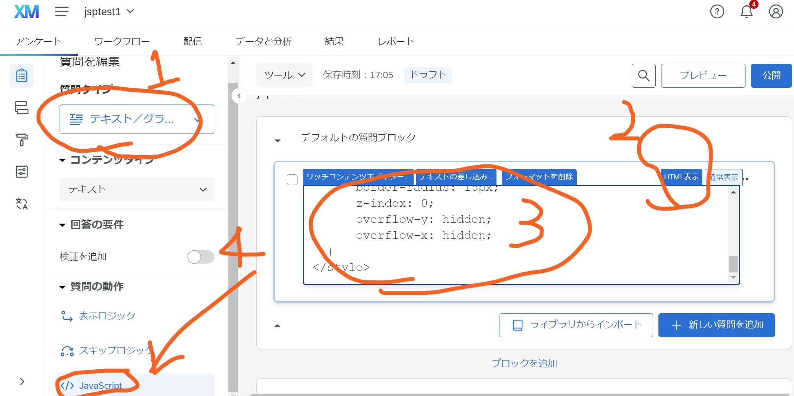

## 情報源
  * [関学柏原さんのページ](https://kscscr.com/archives/jspsych-qualtrics-r.html)
  * [関学小林さんのページ](https://honamik-s.github.io/log/post/200512_jspsych-on-qualt/)
  * [それらの情報源](https://kywch.github.io/jsPsych-in-Qualtrics/)
  
## 手順1: jsPsychで実験を実行する
  1. ファイルの送受信を行うための仕組みをインストールする
  * [git Windows 64bit版](https://github.com/git-for-windows/git/releases/download/v2.37.2.windows.2/Git-2.37.2.2-64-bit.exe)をダウンロードしてインストールする。Windows以外の環境の場合は適切なものを選ぶ。
  2. 実験ファイルを公開するための仕組みを用意する
  * [github](https://github.com)にアカウントを作成する
  * githubにrepositoryを作成する。ここでは例としてjpq6という名前で作成してみる
  * repository内のファイルをhttp経由で（インターネット経由で）見られるようにするために、以下の設定をする。
    * 作成したrepositoryのページを開き（例えばhttps://github.com/imaru/jpq6。ただし、imaruの部分は各自のアカウント名）、ページの上の方にある「Setting」を選択、さらに左メニューから「Pages」を選ぶ。
    * 「Branch」という欄のNoneとなっているところをmainに変更し、右にあるSaveボタンを押す。
    
    {width=600}
    
  3. 実験ファイルを操作するためのソフトを準備する
  * [Visual Studio Code](https://azure.microsoft.com/ja-jp/products/visual-studio-code/)をインストールする。これ以降、VSCodeと呼ぶ。
  4. ファイルを準備する
  * 実験ファイルを置くためのフォルダを用意する。ドキュメントフォルダに例えば「exp」のように実験用ファイルを置く場所を作ることを推奨。フォルダに日本語名を使うのは避けること。
  * さっきインストールしたVSCodeを開き、「ターミナル」メニューから「新しいターミナル」を選ぶ
  * 作成した実験用フォルダに移動する。ドキュメントフォルダにexpというフォルダを作った場合は、以下のように打ち込む。\\は￥のこと。ここでファイルがダウンロードされるので、少し時間がかかる。
    * cd Documents\\exp
  * jsPsychをQualtricsで使うためのテンプレートを入手するために、ターミナルに以下のように打ち込む。最後のjpq6は2で作成したrepositoryの名前にしておく
    * git clone https://github.com/imaru/jqTemplate.git jpq6
  * ターミナルにさらにコマンドを入れるが、その前に[github](https://github.com)にログインして、2で作成したrepositoryのURLをコピーしておく。
  
  {width="600"}
  
  * ターミナルに下のように打ち込む
    * cd jpq6（一つ前で最後につけた名前にすること）
    * git remote set-url origin コピーしたURL
    * git push origin main
  5. 動作の確認1（ローカルでのjsPsych）
  * VSCode の「ファイル」メニューから「フォルダーを開く」を選び、4で入手した実験用フォルダを選択する。この説明の例の通りに進めているとしたら、jpq6というフォルダ。
  * VSCodeの左側のエクスプローラーから、experiment.htmlを選択する。このファイルはjsPsychのチュートリアルで作成するReaction Time Taskのもの。
  * VSCodeの「実行」メニューから「デバッグを開始」を選ぶか、F5キーを押して実験を実行する。
  * 色弁別課題が実行できればOK。自分のPCでjsPsychを使うための準備ができたことになる。
  6. 動作の確認2（サーバ上でのjsPsych）
  * 5までの手順で、自分のgithubアカウントに実験実施に必要なファイルが送られているはずなので、以下のアカウントにアクセスすることで実験が実施されるはず(xxxxxの部分は自分のアカウント、jpq6は2で作成したrepositoryの名前)
    * https://xxxxx.github.io/jpq6/experiment.html
 
## 手順2: QualtricsからjsPsychの実験を実行する
  1. Qualtricsの準備をする
  * [学科専用のQualtricsサイト](https://kanazawait.qualtrics.com/login)からアカウントを作成する（[アカウント作成の説明ファイル](./qualtrics.pdf)）。
  2. Qualtricsで実験実施用のアンケートを作る
  * 新しいプロジェクトを作成する。「一から作成」、アンケート形式で「開始する」をクリック。名前は適当につければOK。ここではjsptest1とする。「空白のアンケートプロジェクトを作成」のままで「プロジェクトを作成する」をクリック。
  3. Qualtricsに実験を移す
  * VSCodeでinstruction.htmlを開き、１行目の「imaru.github.io」の部分を自分の環境に修正する（imaruを自分のGithubアカウントに、jqTemplateをGithubのrepository名[今の例の場合はjpq6]に変更する）。その後、ファイルの内容を全てコピーしておく。
  * 左側メニューの「質問タイプ」をデフォルトの多肢選択式から「テキスト／グラフィック」に変更する(1)。画面右側の質問ブロック内をクリックし、表示を「HTML表示」に変更する(2)。その上で、この欄にひとつ前の項目でコピーした内容を貼り付ける(3)。貼り付けた状態で左側のメニューに「質問の動作」という欄があるので、そこから「JavaScript」を選択する(4)。
  
  {width=600}
  
  * 質問のJavaScriptを編集というウィンドウが開くので、中を一度全て削除する。このウィンドウを開いたまま、一度VSCodeに移る。
  * VSCodeでqualtrics.jsを開く。7行目のimaruとjqTemplateを自分の環境に合わせて変更し（imaruはGithubのアカウント、jqTemplateはGithubのrepository名にする）、全て選択してコピーする。
  * Qualtricsに戻って、さきほど開いて中を消したウィンドウにコピーした内容を貼り付け、保存する。
  
  {width=600}
  
  * データ保存のために必要な作業を行う。ウィンドウ左側の上から2つめのアイコンをクリックし、アンケートフローの編集画面に進む（下図）。
  
  {width=600}
  
  * 「＋こちらに新しい要素を追加」をクリックし、埋め込みデータを選択、ドロップダウンメニューは使わず「datajs」と打ち込む（下図）。その後、ウィンドウ右下にある適用を忘れずにクリックする。
  
  {width=600}
  
  4. 動作の確認
  * ここまでで、Qualtricsで作ったアンケートのプレビューをすることで、実験が実施されるはず。プレビューボタンから実施してみる。
  * 実験が表示されていない場合、これまでの手順のどこかにミスがあるので、エラーの確認を行う。Chromeを使っている場合、以下の手順を行う。まずはブラウザのウィンドウ上で右クリックメニューを出し、「検証」を選択する。
  
  {width=600}
  
  * 開発者ツールが開くので、エラーが起きている場所を探す（エラーは赤く表示される）。下の場合、Failed to load resourceとあるので、実験用ファイルの中で使われているファイルが指定の場所にない可能性が高いので、そのあたりを見直すことになる）。
  
  {width=600}
  
  5. 結果のエクスポートとデータファイルの処理
  * プレビューから実験を実施した場合も、データは保存されている。実験後、少し待つと「データと分析」タブに表示される。「エクスポートとインポート」からエクスポートを選び、csv形式でダウンロードすると良い。
  
  {width=600}
  
  * ダウンロードしたデータはデフォルトではzip圧縮されているので展開する。ファイルには、それまでに実行された全ての参加者のデータが保存されている（1行につき1参加者のデータ）。項目名などの日本語はutf-8という形式でエンコードされているため、エクセルで開くと文字化けしているが、データはどうせ別のソフトで処理するので気にする必要はない。
  
  {width=600}
  
  * エクセルの各列には、Qualtricsで記録された結果が保存されており、jsPsychの実験データは最後の列（見出しはdatajs）にJson形式でまとめて保存されている。エクセルで加工するのは無理なので、何らかのツールを使ってデータ処理をする。RやMATLABにはJson形式のデータを処理する関数があるので、それらを使うのがおすすめ。
    * [MATLABでの処理スクリプト例](qualtdata.m)：このスクリプトはReaction Time Taskのデータを読み込んで、各参加者の正答率と平均正反応時間を表示するもの。より詳細な解析については応相談。